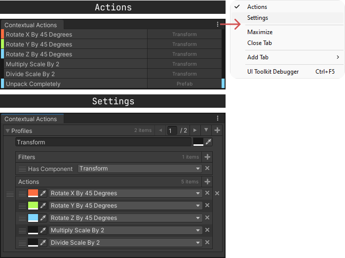

# Contextual Actions

### Requires [Odin Inspector]

A custom editor window that provides contextual actions based on profiles
with which you can specify when certain actions should be shown. The profiles consist
of filters and actions that determine what is displayed and when.

### Usage
Simply put the downloaded ContextualActions folder in your project  
and open the window under  `Tools > Contextual Actions`

[Odin Inspector]: https://odininspector.com/
